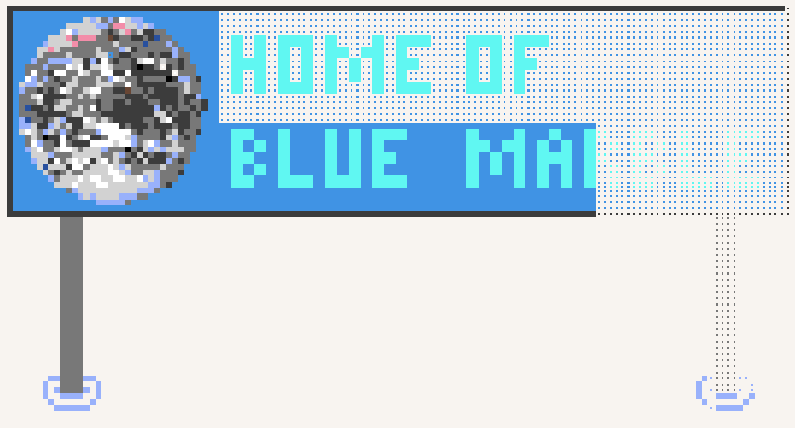

<table>
  <tr>
    <td><a href="#blue-marble">Blue Marble</a></td>
    <td valign="top" rowspan="99"></td>
  </tr>
  <tr>
    <td>&emsp;<a href="#quick-guide">Quick Guide</a></td>
  </tr>
  <tr>
    <td>&emsp;<a href="#overview">Overview</a></td>
  </tr>
  <tr>
    <td>&emsp;&emsp;<a href="#installation-instructions">Installation Instructions</a></td>
  </tr>
  <tr>
    <td>&emsp;&emsp;<a href="#script-settings">Script Settings</a></td>
  </tr>
  <tr>
    <td>&emsp;&emsp;<a href="#template-settings">Template Settings</a></td>
  </tr>
  <tr>
    <td>&emsp;<a href="#how-versioning-works">How Versioning Works</a></td>
  </tr>
  <tr>
    <td>&emsp;<a href="#licenses">Licenses</a></td>
  </tr>
  <tr>
    <td>&emsp;<a href="#faq">FAQ</a></td>
  </tr>
  <tr>
    <td>&emsp;&emsp;<a href="#is-blue-marble-malware">Is Blue Marble malware?</a></td>
  </tr>
    <tr>
    <td>&emsp;&emsp;<a href="#why-are-some-pixels-not-showing-on-the-overlay">Why are some pixels not showing on the overlay?</a></td>
  </tr>
  <tr>
    <td>&emsp;&emsp;<a href="#how-can-blue-marble-place-pixels-for-me">How can Blue Marble place pixels for me?</a></td>
  </tr>
  <tr>
    <td>&emsp;&emsp;<a href="#how-do-i-hide-the-overlay">How do I hide the overlay?</a></td>
  </tr>
  <tr>
    <td>&emsp;&emsp;<a href="#why-do-game-notifications-appear-on-top-of-the-overlay">Why do game notifications appear on top of the overlay?</a></td>
  </tr>
</table>

<h1>Blue Marble</h1>

<h2>Quick Guide</h2>

  Press the arrows to reveal the option you want.
  

    

      <b>I want to download Blue Marble.</b> (Click to Expand)
    

    <a href="#installation-instructions">Click here</a> to view the installation instructions.
  

  

    

      <b>I want to ask questions about Blue Marble.</b> (Click to Expand)
    

    <a href="https://discord.gg/tpeBPy46hf" target="_blank" rel="noopener noreferrer">Click here</a> for the Discord server invite to the Blue Marble support server.
     
    <a href="https://github.com/SwingTheVine/Wplace-BlueMarble/discussions/categories/q-a">Click here</a> for the GitHub help & question page for Blue Marble.
  

  

    

      <b>I want to report a bug.</b> (Click to Expand)
    

    <a href="https://github.com/SwingTheVine/Wplace-BlueMarble/issues/new/choose">Click here</a> to report a bug, then choose the "Bug Report" option.
  

  

    

      <b>I want to suggest a feature.</b> (Click to Expand)
    

    <a href="https://github.com/SwingTheVine/Wplace-BlueMarble/issues/new/choose">Click here</a> to suggest a feature, then choose the Feature Request" option.
  

  

    

      <b>I want to contribute.</b> (Click to Expand)
    

    <a href="https://github.com/SwingTheVine/Wplace-BlueMarble/blob/main/docs/CONTRIBUTING.md">Click here</a> to read the contributing guidelines.
  

  

    

      <b>I want to report a vulnerability.</b> (Click to Expand)
    

    <a href="https://github.com/SwingTheVine/Wplace-BlueMarble/security">Click here</a> to submit a vulnerability report.
  

  

    

      <b>I want to visit the website.</b> (Click to Expand)
    

    <a href="https://bluemarble.lol/" target="_blank" rel="noopener noreferrer">Click here</a> to visit the official Blue Marble website.
  

<h2>Overview</h2>

  Welcome to Blue Marble! Blue Marble is a userscript for the website <a href="https://wplace.live/" target="_blank" rel="noopener noreferrer">wplace.live</a>. The purpose of Blue Marble is to allow you to take an image, and layer it onto the canvas! That way, you can easily trace the image of your art, without having to look back and forth between multiple tabs/monitors. In addition, Blue Marble supports some neat extra features such as: 
  <ul>
    <li>Displaying the number of pixels you need to level up</li>
    <li>Displaying a simple coordinate system (tile coordinats & pixel coordinates)</li>
    <li>Allowing you to move the color palette to the top of the screen when placing pixels</li>
    <li>Allowing you to use the eyedropper on the template image, provided the colors are correct</li>
    <li>Minimizing or maximizing the menu to switch between compact and full views</li>
    <li>Filtering overlay colors by toggling individual template colors or using global enable/disable buttons</li>
    <li>...and more!</li>
  </ul>

  Some tips and tricks for using Blue Marble:
  <ul>
    <li>Clicking the globe icon next to the "Blue Marble" label on the Script GUI will collapse the UI and allow it to be drug around the screen.</li>
    <li>Under the Wplace Paint selector, there is a button near the top labeled "Move ↑" This will allow you to move the paint window to the top of the screen. Please note; it resets after the paint placement has been confirmed, but can be moved back up in the same way.</li>
    <li>Disabling different colors using the Color Filter and having one selected at a time makes larger images easier to manage.</li>
    <li>Using the color picker on the center of any template placeholder pixel will select the color in the template.</li>
    <li>Clicking the art tray icon at the bottom will take you to a website for converting images to the wplace format. Please note this website is NOT affiliated with Blue Marble.</li>
    <li>You can extend the Status window by selecting the little arrow above the "MADE BY SWINGTHEVINE" slug and dragging downward.</li>
  </ul>

  If you like this userscript, please ⭐ the repository! For more information and updates, visit the <a href="https://bluemarble.lol/" target="_blank" rel="noopener noreferrer">Blue Marble website</a>. If you wish to contribute to Blue Marble, check out the <a href="https://github.com/SwingTheVine/Wplace-BlueMarble/blob/main/docs/CONTRIBUTING.md" target="_blank" rel="noopener noreferrer">CONTRIBUTING.md</a> file in <code>docs/</code>.

  

  <h3>Installation Instructions</h3>
  
  
  

    Blue Marble has been verified to work on mobile devices. Blue Marble was designed on Chrome, but Blue Marble might work on "unsupported" browsers not listed above. Some versions/forks of Firefox work. Some versions/forks of Firefox do not work.
     
    Installation instructions for Blue Marble are below. Click the arrows to expand the instructions you want to see. Blue text is a link.
    

      

        <b>Install Chrome</b> (Click to expand)
      

      
      <ol>
        <li>Install the <a href="https://chromewebstore.google.com/detail/tampermonkey/dhdgffkkebhmkfjojejmpbldmpobfkfo" target="_blank" rel="noopener noreferrer">TamperMonkey</a> extension for Chrome.
         
        </li>
        <li>Right-click the extension.
         
        </li>
        <li>Left-click "Manage Extension."</li>
        <li>Enable "Developer Mode."
         
        </li>
        <li>Enable "Allow user scripts."</li>
        <li><strong>One-click install:</strong> Click this link to Install Blue Marble directly: <a href="https://github.com/SwingTheVine/Wplace-BlueMarble/releases/download/pre/BlueMarble.user.js" target="_blank" rel="noopener noreferrer"><strong>Install Blue Marble</strong></a>
         
        TamperMonkey will automatically detect the userscript and prompt you to Install it.</li>
        <li>Refresh the <a href="https://wplace.live/" target="_blank" rel="noopener noreferrer">wplace.live</a> webpage.</li>
        <li>Close the web browser fully and restart it.</li>
      </ol>
      <b>Toggling on/off Hardware Acceleration</b>(Only if you are having performance issues)
      <ol>
        <li>Click the “⋯" Menu in Chrome or go to the url: chrome://settings</li>
        <li>Select “System"</li>
        <li>Under: “Use Hardware Acceleration when Available", toggle the setting OFF. Turn it back ON after.</li>
        <li>If it is already off, turn it on.</li>
        <li>Restart your web browser by fully closing and opening back up.</li>
      </ol>
    

    

      

        <b>Install on Microsoft Edge</b> (Click to expand)
      

      <ol>
        <li>Install the <a href="https://microsoftedge.microsoft.com/addons/detail/iikmkjmpaadaobahmlepeloendndfphd" target="_blank" rel="noopener noreferrer">TamperMonkey</a> plugin for Microsoft Edge.
         
        </li>
        <li>Right-click the extension.
         
        </li>
        <li>Left-click "Manage Extension."</li>
        <li>Enable "Developer Mode."
         
        </li>
        <li>Download the <a href="https://github.com/SwingTheVine/Wplace-BlueMarble/releases" target="_blank" rel="noopener noreferrer">BlueMarble.user.js</a> file in the "Assets" of the latest release.</li>
        <li>Open the TamperMonkey Dashboard.
         
        </li>
        <li>Drag the <code>BlueMarble.user.js</code> file inside the dashboard of TamperMonkey.
         
        </li>
        <li>Click the "Install" button to Install Blue Marble.
         
        </li>
        <li>Enable Blue Marble inside the TamperMonkey dashboard.
         
        </li>
        <li>Refresh the <a href="https://wplace.live/" target="_blank" rel="noopener noreferrer">wplace.live</a> webpage.</li>
         
        <li>Close the web browser fully and restart it.</li>
      </ol>
      <b>Toggling on/off Hardware Acceleration</b>(Only if you are having performance issues)
      <ol>
        <li>Open the “Settings and more" menu by clicking the “⋯" in the top right corner. Alt + F will also open this.</li>
        <li>If not using the shortcut, a menu will open. Select “Settings."</li>
        <li>Select “System and Performance"</li>
        <li>Under: “Use Hardware Acceleration when Available", toggle the setting OFF. Turn it back ON after.</li>
        <li>If it is already off, turn it on.</li>
        <li>Restart your web browser by fully closing and opening back up.</li>
      </ol>
    

    

      

        <b>Install on Firefox</b> (Click to expand)
      

      <ol>
        <li>Install the <a href="https://addons.mozilla.org/en-US/firefox/addon/tampermonkey/" target="_blank" rel="noopener noreferrer">TamperMonkey</a> plugin for Firefox.
         
        </li>
        <li><strong>One-click install:</strong> Click this link to Install Blue Marble directly: <a href="https://github.com/SwingTheVine/Wplace-BlueMarble/releases/download/pre/BlueMarble.user.js" target="_blank" rel="noopener noreferrer"><strong>Install Blue Marble</strong></a>
         
        TamperMonkey will automatically detect the userscript and prompt you to install it.</li>
        <li>Refresh the <a href="https://wplace.live/" target="_blank" rel="noopener noreferrer">wplace.live</a> webpage.</li>
         
        <li>Close the web browser fully and restart it.</li>
      </ol>
      <b>Toggling on/off Hardware Acceleration</b>(Only if you are having performance issues)
      <ol>
        <li>Click the "Hamburger Menu" or “☰" Menu in Firefox. This is usually in the top right.</li>
        <li>Select "Settings."</li>
        <li>Select the “General" tab on the Left Sidebar.</li>
        <li>Scroll down to “Performance"</li>
        <li>Under “Use recommended performance settings" turn the option OFF, then back ON.</li>
        <li>If it is already off, turn it on.</li>
        <li>Restart your web browser by fully closing and opening back up.</li>
      </ol>
    

    

      

        <b>Install on Opera/Opera GX</b> (Click to expand)
      

      <ol>
        <li>Install the <a href="https://www.tampermonkey.net/index.php?browser=opera" target="_blank" rel="noopener noreferrer">TamperMonkey</a> extension for Opera <i>or</i> <a href="https://chromewebstore.google.com/detail/tampermonkey/dhdgffkkebhmkfjojejmpbldmpobfkfo" target="_blank" rel="noopener noreferrer">TamperMonkey</a> extension for Chrome.
         
        </li>
        <li>Right-click the extension.
         
        </li>
        <li>At the top of the extensions menu click the toggle for "Developer Mode"</li>
         
        </li>
        <li><strong>One-click install:</strong> Click this link to Install Blue Marble directly: <a href="https://github.com/SwingTheVine/Wplace-BlueMarble/releases/download/pre/BlueMarble.user.js" target="_blank" rel="noopener noreferrer"><strong>Install Blue Marble</strong></a>
         
        TamperMonkey will automatically detect the userscript and prompt you to Install it.</li>
        <li>Navigate to the <a href="https://wplace.live/" target="_blank" rel="noopener noreferrer">wplace.live</a> webpage.</li>
        <li>Right click Tamper Monkey and select "Page Access"</li>
        <li>In the menu select "Allow" Tamper Monkey access to "Always Run on Wplace.Live"</li>
        </li>
        <li>Close the web browser fully and restart it.</li>
      </ol>
      <b>Toggling on/off Hardware Acceleration</b>(Only if you are having performance issues)
      <ol>
        <li>Click the “Opera Logo" Menu in the top left, or go to the url: opera://settings</li>
        <li>Select "Settings."</li>
        <li>Scroll down to: “System."</li>
        <li>Under: “Use Hardware Acceleration when Available" or “Use Graphics Acceleration when Available" toggle the setting OFF. Turn it back ON after.</li>
        <li>If it is already off, turn it on.</li>
        <li>Restart your web browser by fully closing and opening back up.</li>
      </ol>
      <b>Extended Options for Opera</b>(Only if you are having performance issues)
      <ol>
        <li>Turn Hardware Acceleration OFF</li>
        <li>Visit opera://flags/#use-angle in the Address Bar, and set the flag to "opengl".</li>
        <li>Re-Enable Hardware Acceleration.</li>
        <li>Shut down your browser FULLY and open back up.</li>
        <li>Visit opera://gpu which reports if hardware acceleration is active. If it is NOT, then return to opera://flags/#use-angle and remove the flag.</li>
      </ol>
    

    

      

        <b>Install on Mobile Browsers</b> (Click to expand)
      

      <i>Blue Marble does work on Mobile Platforms.. with some caveats. Not all browsers support extensions. Not all Mobile OS's support extension browsers. In the case of Android, Edge is known to have the capability, as is Firefox in some cases. In the case of IOS, there's multiple browser-extension compatible browsers, but I have only personally tested on Safari. Due to the nature of mobile operating systems it's a hit or a miss on if it's going to be stable, functional, or even if the script will be able to function. So I don't personally help with their function. There's too many variables. However, if you are able to get TamperMonkey or ViolentMonkey or any similar script extension to work with your mobile browser, chances are Blue Marble WILL Work. On Android I believe these are free. On IOS, Tamper is $3 on the app store. 
       In all cases, after install there are a myriad of additional steps to get these to work. While unable to test on android, I can test on IOS and in that case, after installation there's some.. annoyances. 
      <ol>
        <li>Install TamperMonkey from the Google Play or App Store. This should be like installing a normal application.</li>
        <li>{IOS Instructions] Navigate to: Settings > Apps > TamperMonkey, Set your Document Storage. This will either be on a networked share folder if you want to transfer between PC and Mobile, or a folder on your device you will dedicate to TamperMonkey.</li>
        <li>{IOS Instructions] Navigate to: Settings > Apps > Safari > Extensions > TamperMonkey - Allow extension in the browser profiles you use. Scroll down to Permissions and enable "This extension can read and alter webpages.."</li>
        <li>{IOS Instructions] There will be a prompt to allow Tamper Monkey to access TamperMonkey.Net. Allow this.</li> 
        <li>{IOS Instructions] From here, the install is generally the same for the script to any other device.</li> 
      </ol>
    

    

      

        <b>Some Post-Install issues and how to resolve them</b> (Click to expand)
      

      <i>In all cases, Developer mode must be enabled in your browsers Extension/Browser settings to use Blue Marble/Tamper Monkey. You must also <b>always fully restart your browser after a userscript installation.</b> If these options do not work, reinstall Tamper Monkey and Blue Marble by copying and pasting the contents of <a href="https://github.com/SwingTheVine/Wplace-BlueMarble/blob/main/dist/BlueMarble.user.js" target="_blank" rel="noopener noreferrer">main/dist/BlueMarble.user.js</a> into a script window in Tamper Monkey.</i>
       
        <h3>Firefox</h3>
      <ol>
        <li>There have been instances of Firefox not being able to load the Blue Marble overlay, or Displaying all Pixels in Black. Firefox only allows for a smaller size of image display. It's a browser limitation, not a Blue Marble limitation.</li>
        <li>If Developer Mode is on, use CTRL+F5 to refresh the page.</li>
        <li>Fully shut-down Firefox and open it back up. It's recommended task manager is used for this.</li>
        <li>If you are still having problems, ensure there are no "Page Access" options unselected in the Extension menu for Tamper Monkey.</li>
      </ol>
       
        <h3>Chrome/Chrome Forks/Microsoft Edge</h3>
      <ol>
        <li>Open your Extensions page, select TamperMonkey in this menu to see more settings for the Extension. (Not the TamperMonkey menu, but the <b>Chrome</b> menu for TamperMonkey.) You can also right click Tamper Monkey and select "Manage Extension" From here; Toggle "Allow User Scripts" then disable and re-enable the extension to refresh it on the Wplace website.</li>
        <li>If Developer Mode is on, use CTRL+F5 to refresh the page.</li>
        <li>Try fully shutting down the browser via task manager and reopen it.</li>
      </ol>
       
        <h3>Opera/Opera GX</h3>
      <ol>
        <li>ORight-click Tamper Monkey in your extensions bar. Under "Page Access" Select "Allow"</li>
        <li>If Developer Mode is on, use CTRL+F5 to refresh the page.</li>
        <li>Try fully shutting down the browser via task manager and reopen it.</li>
      </ol>
       <b>Note:</b> None of these options account for a bad template being loaded. It is suggested to try a different browser if you are having difficulty.
    

   

  <h3>Template Instructions</h3>
  

    Blue Marble will display your template as the same size. If your image is 500 pixels tall and 300 pixels wide, the template will be 500 pixels tall and 300 pixels wide. Here is the instructions to display a template image on the canvas:
    <ol>
      <li>Find the pixel of the top left corner. Fill in <code>Tl X</code>, <code>Tl Y</code>, <code>Px X</code>, and <code>Px Y</code> with the coordinates. You can use the "Pin" icon to auto-fill the coordinates after clicking the pixel.
       
      </li>
      <li>Upload a PNG or WEBP image.</li>
      <li>Click the "Create" button.</li>
      <li>If your template still does not show, try clicking the "Enable" button.</li>
    </ol>
  

  <h3>Script Settings</h3>
  

    There are many settings available for the Blue Marble userscript! Through these settings, you can control how the script behaves.
  

  <h3>Template Settings</h3>
  

    <h4>Transparent Pixels</h4>
    

      Templates for Blue Marble work slightly different from normal. Since there is a "Transparent" color, and transparent pixels in templates are typically ignored, your template should have a custom color to signify "Transparent" colored pixels.
      <ul>
        <li>If you want a specific pixel to be any color, it should be transparent in your template.</li>
        <li>If you want a specific pixel to be the "Transparent" color on the Wplace palette, it should have the <code>#deface</code> hex color.</li>
      </ul>
    

    <h4>Coordinates</h4>
    

      <h5>Tile Coordinates</h5>
      

        The coordinate system for wplace.live is unique. Instead of all pixels having a global coordinate number (x, y), the coordinate number is relative to the tile. This means you need to know the tile number and the coordinate number to do anything. In Blue Marble, the tile coordinates and the pixel coordinates are displayed when you click on a pixel. These are the coordinates you should use for aligning a template.
         
        
      

      <h5>Template Coordinates</h5>
      

        The template is aligned from the top left corner of the template. You can auto-fill this position using the "pin" (also called "waypoint") icon next to the coordinate input boxes.
      

    

  

<h2>How Versioning Works</h2>

  The versioning system for this userscript follows the <a href="https://semver.org/" target="_blank" rel="noopener noreferrer">Semantic Versioning rules</a>. As such, it is formatted in an <code>X.Y.Z</code> format where:
  <ul>
    <li>X is the major version. This is incremented when a non-backward compatible update is pushed. This is for new features that break previous versions of the userscript. Additionally, if wplace.live breaks the userscript, this will be incremented.</li>
    <li>Y is the minor version. This is incremented whenever I push to GitHub. This is for stable bug-fixes and new (non-breaking) features.</li>
    <li>Z is the patch version. This is incremented whenever I launch a development version of the userscript to test a patch. This is for unstable bug-fixes/features.</li>
  </ul>

<h2>Licenses</h2>

  (Below, all mentions of the "userscript" refer to the "Blue Marble" userscript made by SwingTheVine)  
  Most of this userscript is licensed under the <code>Mozilla Public License Version 2.0</code> (MPL-2.0). All software, code, and libraries in this repository are licensed under the MPL-2.0 license. However, the "Blue Marble" image in this userscript is owned by NASA and is licensed under the <code>Creative Commons 0 1.0 Universal</code> (CC0 1.0) license.

<h2>FAQ</h2>

  <h3>Is Blue Marble malware?</h3>
  
<b>A:</b> Blue Marble does not contain malicious code. The Blue Marble code can be found in the <code>src/</code> folder. If you worry about Blue Marble being malware, you can read the code, then bundle it yourself using the tools in <code>build/</code>.

  <h3>Why are some pixels not showing on the overlay?</h3>
  
<b>A:</b> This usually happens if the template image is not converted to the Wplace color palette. You should convert your template using a color converter for Wplace, or manually adjust the template image to match the Wplace color palette. Also check that no pixels are disabled in the filter settings of the Blue Marble menu.

  <h3>How can Blue Marble place pixels for me?</h3>
  
<b>A:</b> Unfortunately, Blue Marble will not support the automatic placement of pixels without user interaction because it is not allowed by Wplace.

  <h3>How do I hide the overlay?</h3>
  
<b>A:</b> You can temporarily hide the overlay by clicking the "Disable" button in the Blue Marble menu.  
   
  If you want to completely remove both the overlay and the Blue Marble menu, turn off the userscript in Tampermonkey and refresh the page.

  <h3>How do I tell colors apart?</h3>
  
<b>A:</b> Find the color in the color filter list. Click the checkbox to turn the color on or off. If you want to work on only one color at a time (recommended), then click "Disable All" in the color filter. Finally, enable the checkbox next to the color you want to place. This way, only one color on your template will appear at a time.

  <h3>How do get the color of a pixel?</h3>
  
<b>A:</b> Use the eyedropper in the palette menu of wplace. If your template colors match the wplace palette, you can select the template pixel dot to get the template's color for that pixel.

  <h3>How do I tell colors apart?</h3>
  
<b>A:</b> Find the color in the color filter list. Click the checkbox to turn the color on or off. If you want to work on only one color at a time (recommended), then click "Disable All" in the color filter. Finally, enable the checkbox next to the color you want to place. This way, only one color on your template will appear at a time.

  <h3>How do get the color of a pixel?</h3>
  
<b>A:</b> Use the eyedropper in the palette menu of wplace. If your template colors match the wplace palette, you can select the template pixel dot to get the template's color for that pixel.

  <h3>Why do game notifications appear on top of the overlay?</h3>
  
<b>A:</b> Game notifications only appear when they need immediate attention. Therefore, they have priority over the overlay (which typically needs no attention).

  <h3>What does the "Wrong" counter mean? Why is it only showing incorrect information?</h3>
  
<b>A:</b> Sometimes the painted pixel count will read as all pixels being wrong. This is not going to hurt the program working, and can safely be ignored. This function is also not always fully functional. It may show incorrect data, and it’s been known to always show 1 pixel being wrong in some cases. 

  <I>If you require the function, it will break every page refresh. Simply reset your template point and reload your template to fix the data.</I>

